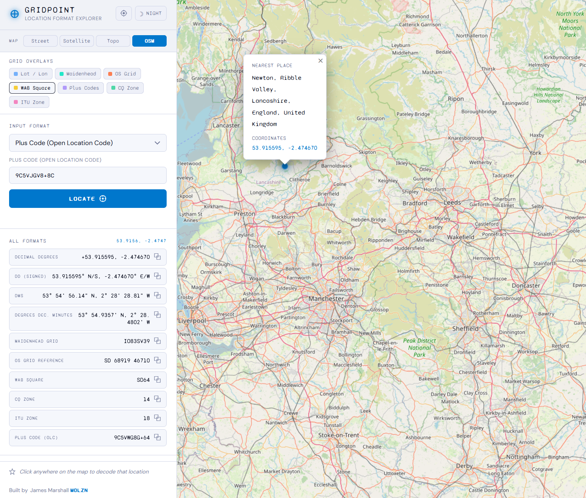

# GridPoint — Location Format Explorer

A web application for converting between location formats and visualising points on an interactive map.

## Screenshot



## Supported Formats

| Format | Input | Output |
|--------|-------|--------|
| Latitude/Longitude — Decimal Degrees | ✅ | ✅ |
| Latitude/Longitude — Degrees Minutes Seconds | ✅ | ✅ |
| Latitude/Longitude — Degrees Decimal Minutes | ✅ | ✅ |
| Maidenhead Grid Locator | ✅ | ✅ |
| UK Postcode | ✅ | — |
| Town / Place Name | ✅ | — |
| OS Grid Reference | ✅ | ✅ |
| WAB Square | ✅ | ✅ |
| What3Words | ✅* | — |
| CQ Zone | — | ✅ |
| ITU Zone | — | ✅ |
| Plus Code | ✅ | ✅ |

*What3Words input requires an API key (free tier available).

## Quick Start

### With Docker Compose (recommended)

```bash
docker-compose up --build
```

Then open http://localhost:8080

### With Docker directly

```bash
docker build -t gridpoint .
docker run -p 8080:8080 gridpoint
```

### To change the port

```bash
docker run -p 9000:8080 gridpoint
# then open http://localhost:9000
```

## What3Words Setup (Optional)

1. Get a free API key at https://developer.what3words.com
2. Set it in `docker-compose.yml`:
   ```yaml
   environment:
     - W3W_API_KEY=your_key_here
   ```
   Or export it before running:
   ```bash
   export W3W_API_KEY=your_key_here
   docker-compose up
   ```

## Usage

**To locate a point:**
1. Select an input format from the dropdown
2. Enter the location value(s)
3. Press **LOCATE** or hit Enter

**To decode a map point:**
- Click anywhere on the map — all formats for that location appear in the sidebar

**To copy a format:**
- Click the ⧉ icon next to any result

## Notes

- OS Grid Reference, WAB Square conversions apply to Great Britain only
- What3Words input requires API key; all other formats work offline
- UK Postcode lookup uses the free postcodes.io API
- Town/place lookup uses OpenStreetMap Nominatim
- CQ and ITU zones are calculated algorithmically (±1 zone accuracy near boundaries)

## Running Without Docker

```bash
cd app
python server.py
```

Requires Python 3.8+ — no additional packages needed.

## Author

Built by **James Marshall (M0LZN)** — [m0lzn.com](https://m0lzn.com)
